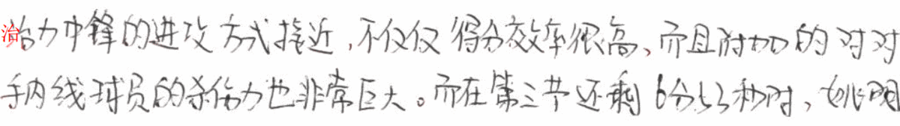
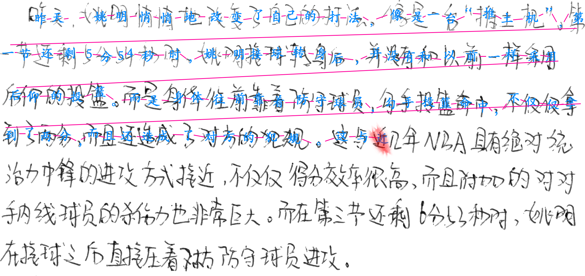

# UDAR: Unified Document Analysis and Recognition for Handwritten Chinese

The process of recognition moves along with changes in attention map. Current character recognition is located at the center of mass of the attention weights.

